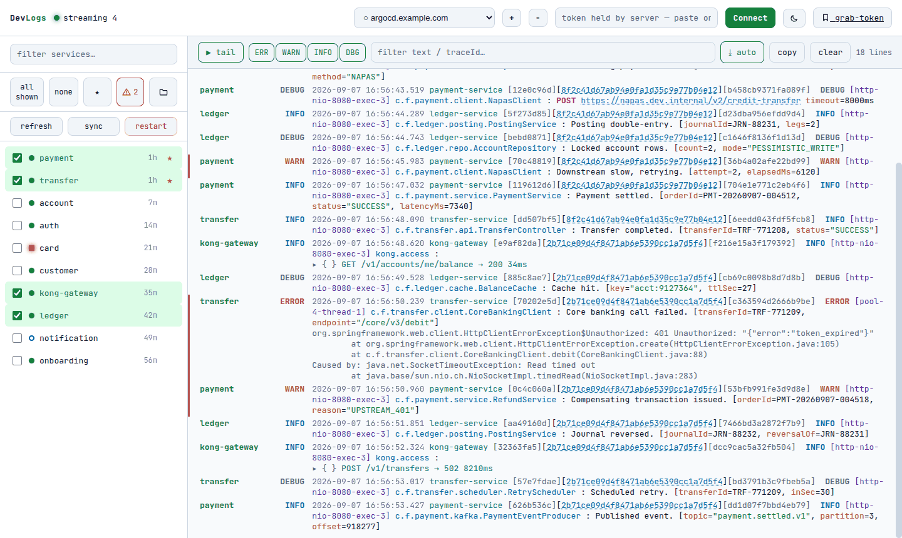
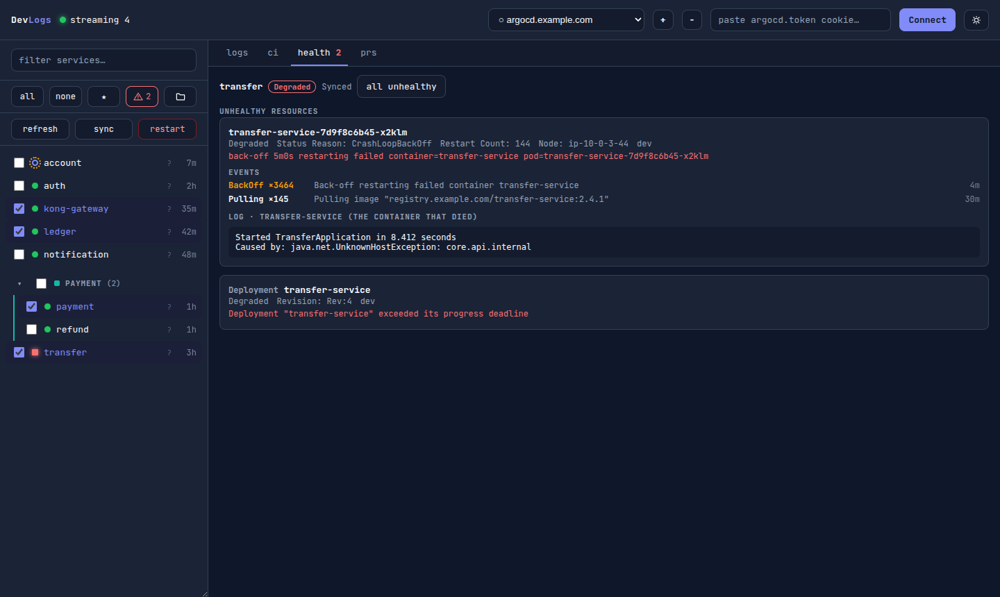
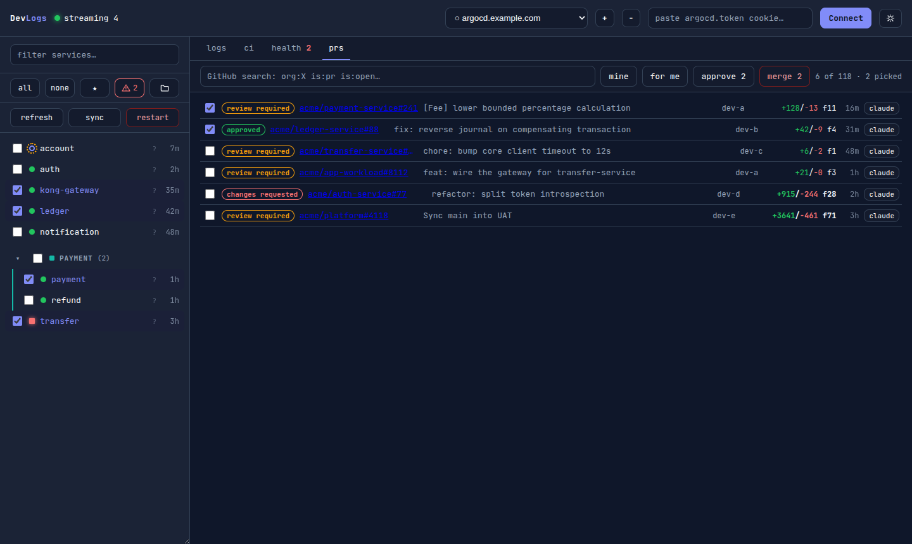
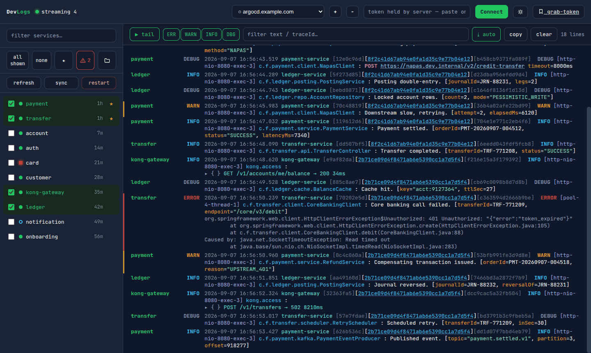

# DevLogs

A local dev console for an ArgoCD estate: live logs from many services merged into one
time-ordered stream, why a service is red, its CI, and the open pull requests — in one page.

No Loki, no docker, no build step. One `index.html`, one `server.py`, and the `argocd` and `gh`
CLIs you already have.

[Hướng dẫn tiếng Việt](docs/HUONG-DAN.md)



## Run

```bash
./run.sh                       # or: python3 server.py
```

Then <http://localhost:8900>.

```bash
export ARGOCD_SERVER=argocd.example.com          # first domain in the picker
export ARGOCD_SERVERS=argocd-a.example.com,...   # optional extras
export ARGOCD_BIN=/opt/homebrew/bin/argocd       # if it is not on PATH
export DEVLOGS_SRC_ROOT=~/projects/finx          # where your service checkouts live
```

Needs `python3`, `argocd` for logs and health, `gh` for ci and prs, `claude` for the review and
analysis buttons. Domains live in `.devlogs-domains.json`; the `+` / `−` buttons maintain it.

## Token

DevTools → Application → Cookies → `argocd.token` → paste it in the header, which then shows how
long it has left. An expired one makes ArgoCD answer `invalid session: failed to verify the token`,
which reads like a bug in this app, so the header says what it really is.

Memory only: never on disk, never in a log. F5 does not lose it, and a restarted server does not
strand the page — the stream backs off and resumes on the next paste. `argocd login --sso
--grpc-web` is used instead where it works, which it does not against an SSO client with no
`http://localhost:8085/auth/callback` redirect.

## Tabs

### logs

Tick services on the left; their logs stream in merged and sorted by timestamp.

- The ~140 characters of prefix the clusters repeat are folded away; `raw` brings the line back.
- Level buttons filter; the text box filters text or a traceId; click a traceId to isolate a flow.
- Stack traces and JSON stay in one event. Double-click a line to copy it.
- Each row shows its pod count (`ready/total`, red when short, nothing for a pod-less app).

### health



Everything unhealthy, and for one service: its conditions, then each unhealthy **resource** — not
only pods — with its Kubernetes events and, for pods, the log tail of the container that *died*.

`ask claude` sends that to the local `claude` CLI and gets prose back: likely cause, the evidence,
what to check next. It also reads the service's GitOps directory (image tag, limits, env, probes),
where half of why a service is down lives without ever reaching its logs. With the repo checked out
under `DEVLOGS_SRC_ROOT` the CLI runs there and can name the file at fault; without one it runs in
an empty directory, so it cannot blame the wrong codebase. Manifests name secrets, never carry them.
The same button in the logs toolbar sends the lines on screen instead.

Muted services are muted here too, and stop counting against the tab badge.

### ci

GitHub Actions for the ticked services, default branch only. Per workflow: the latest run and, when
red, the commit that broke it plus that job's failing log.

A monorepo — several deployables in one repo, each with its own workflows — shows each app only the
workflows that build *its* image, read from the `image_name` the workflow declares. Ones that
declare none are shared and always show. A repo that builds a single image two apps both deploy is
not filtered: that is one CI, deployed twice. Below it, the deploy history from the
GitOps repo — the app → directory mapping is read from each `.argocd-source-<app>.yaml`, so it is
exact rather than guessed.

### prs



Open pull requests in one GraphQL search, with the review decision and the diff size — a four-figure
diff is printed bold, not something to approve inside a batch.

- `claude` reviews the diff through the local CLI, applying your `CLAUDE.md`, no API key. Findings
  come back as a checklist; untick what you disagree with and the rest post as **one** inline
  review. A finding whose line is not in the diff cannot be posted — GitHub rejects those, so it is
  caught here instead of halfway through.
- `approve` / `merge` run `tools/approve-prs.py` and `tools/merge-prs.py`, which also work from the
  shell. `~/bin/` wins over the shipped copy; `DEVLOGS_APPROVE_BIN` / `DEVLOGS_MERGE_BIN` win over
  both.
- Both dry-run first and the dialog shows that output, so a merge tells you which PRs it refuses and
  why. Over three PRs you type the action. There is no approve-everything button.
- `all` ticks what the current search loaded. Past thirty the buttons go dead: the tools drop
  references past the thirtieth without saying so. A new search clears the picks.

Needs no ArgoCD token; only `gh`.

## Keys and layout

`/` focuses the service filter, `Escape` empties it. Drag the sidebar's right edge to resize it.
`★` stars a service, `⊘` mutes it into a collapsed folder; a group mutes and unmutes as a group.

The bell alerts when a **starred** service turns red — once per transition, desktop notification if
you grant permission. Mute beats star, and it only fires while the tab is open: a nudge, not a pager.

It also alerts when the default branch goes red right after a pull request **you** wrote or merged —
nobody else is going to fix that one. Once per merge commit, remembered across reloads rather than
reset by them, three days back, every repo in one search. Needs `gh`, not an ArgoCD token.

## Notes

- Colour means status: `--ok` is green for healthy / approved / success and nothing else, chrome is
  indigo, and every text colour is ≥ 4.5:1 on all three surfaces in both themes.
- Pod counts, events and previous-container logs come from the ArgoCD REST API — the only place the
  resource tree exists. Everything else goes through `argocd` and `gh`.
- `restart`, `sync`, `rerun`, `approve` and `merge` confirm first; `restart` makes you type the word.
- `python3 test_server.py` runs the checks: no framework, no network.


