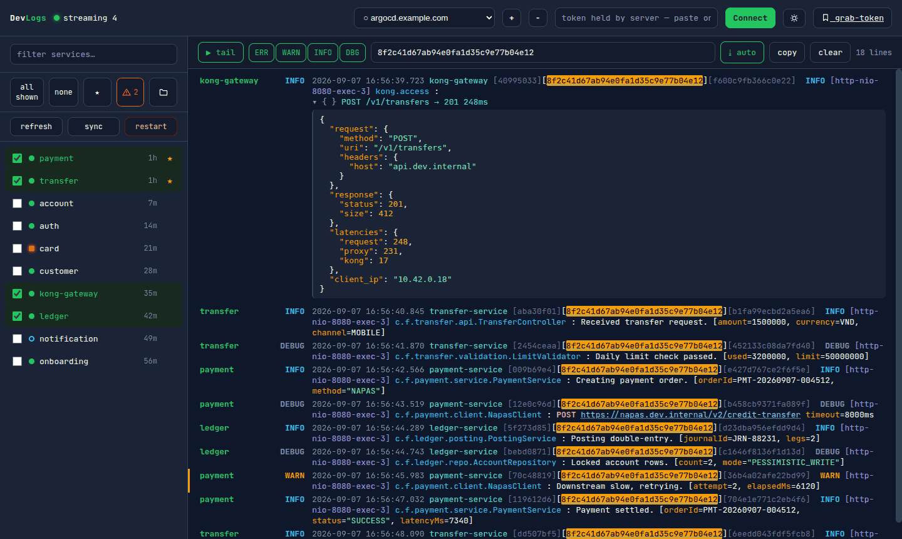

# argo-dev-log — DevLogs UI

Multi-service live log viewer for ArgoCD dev clusters. Streams `argocd app logs` for many services
straight into the browser over SSE, merged and time-sorted, with service health, prefix folders,
JSON folding, and restart/sync/refresh from the sidebar.

Stdlib Python + one HTML file. No Loki, no docker, no npm, no pip install. Tokens live in the
backend's memory only — never written to disk, never logged.

## Requirements
- Python 3.8+ (`python3` — macOS ships it with the Command Line Tools, Linux via your package manager)
- The `argocd` CLI, logged in to nothing in particular: this tool passes the token itself
  - macOS: `brew install argocd`
  - Linux: `curl -sSLo ~/.local/bin/argocd https://github.com/argoproj/argo-cd/releases/latest/download/argocd-linux-amd64 && chmod +x ~/.local/bin/argocd`
  - elsewhere: `export ARGOCD_BIN=/path/to/argocd`

## Install & run
    git clone git@github.com:BaoLy-CMC/argo-dev-log.git
    cd argo-dev-log
    ./run.sh            # http://localhost:8900, opens your browser

Optional per-machine settings, e.g. in `~/.argocd-env` (sourced by `run.sh` if present):

    export ARGOCD_SERVER=argocd.nonprod.example.io      # default domain
    export ARGOCD_SERVERS=argocd.uat.example.io         # extra domains, comma-separated
    export DEVLOGS_PORT=8900
    export DEVLOGS_OPEN=0                               # do not open the browser
    export ARGOCD_BIN=/opt/homebrew/bin/argocd

Then in the UI:
1. Pick the domain in the header, paste its `argocd.token` cookie -> **Connect**.
2. Tick services on the left (filter box, folders, stars, all/none). ⊘ mutes a service: it drops into a collapsed **muted** folder at the bottom and stops counting towards the unhealthy badge.
3. Each row shows its pod count (`ready/total`, red when a pod is short; nothing at all for a config-only app with no pods) and each folder gets a stable colour on its dot and branch line. Counts are fetched only for the rows on screen — drag the sidebar's right edge to widen it.
4. Live logs stream in the middle — level filter, text/traceId filter, click a traceId to isolate a flow, double-click a line to copy it.
5. Lines are shown compact: one time column, the short logger and the traceId, without the ~140 characters of repeated prefix the clusters emit. **raw** in the toolbar shows the untouched line.

The header button toggles the light and dark theme; it follows your OS on first run.

Click a traceId to isolate one flow across every selected service; JSON payloads (Kong access logs,
request/response dumps) fold to a one-line summary and expand on click.

## Domains
Several ArgoCD servers, one token each. The header picker shows `●` when the backend holds a token
for that domain and `○` when it does not; switching stops the stream, clears the selection and loads
that domain's services. `+` adds a domain (hostname only, validated), `−` removes it and drops its
token from memory.

The domain list comes from `ARGOCD_SERVER` (the default), `ARGOCD_SERVERS` (comma-separated extras)
and `.devlogs-domains.json`, which the `+`/`−` buttons maintain. **That file holds hostnames only** —
tokens never leave memory.

## Token — two ways to get it in
- **Paste (always works):** DevTools → Application → Cookies → `argocd.token` → paste.
- **grab-token bookmarklet:** drag the header button to your bookmarks bar; click it *while on the
  ArgoCD tab*. It reads the token and POSTs it here. Works ONLY if the cookie is not HttpOnly and the
  ArgoCD page's CSP allows a fetch to localhost — the bookmarklet alerts and tells you to fall back
  to paste if either blocks it.

Reloading the page (F5) does not lose the token: it lives in the backend, so the UI probes
`/api/apps` on load and picks the session back up. Selected services are not restored — re-tick them.

Token is held in server memory (never written to disk, never logged). It expires ~hourly (Keycloak
ID token, no refresh) — when the stream errors with "token expired?", paste a fresh one and reconnect.

## How many services at once
No hard cap, but each selected service = one `argocd app logs -f` subprocess + one connection to the
ArgoCD server. Practical: ~10–20. The viewer keeps the last 5000 lines client-side (older drop).

## Sorting
The backend buffers ~1.2s and re-orders lines by their own UTC timestamp before emitting, so the
merged stream is roughly time-ordered across services. That 1.2s is also the max added latency —
the inescapable trade-off of live + sorted. Tune `WINDOW` in server.py.

A line that looks like a continuation joins the previous one instead of becoming its own row: one
event = one row, one level, one timestamp, and grep/copy act on the whole thing. Continuation means
indented (stack frames, config dumps), `Caused by:`/`Suppressed:`, or an exception head at column 0
(`org.spring...HttpClientErrorException$Unauthorized: 401 ...`). Everything else at column 0 starts a
new row — a Kong JSON line or `127.0.0.6 - -` access log has no timestamp either, and gluing those
together would merge the whole stream. The event closes when the next timestamped line arrives or after `IDLE_FLUSH` (0.4s)
of silence — so worst-case latency is WINDOW + IDLE_FLUSH. `MAX_EVENT_LINES` (200) caps a runaway dump.

## Reconnects
The `argocd app logs` stream dies on idle timeout. Reconnecting used to re-request `--tail 1`, which
re-printed the last line — on a quiet service that meant the same old log every cycle, forever. It now
asks for `--since-seconds <gap>` (the seconds the drop cost, capped at 60) and drops any line it just
showed, so a reconnect prints only what actually happened. The "stream dropped, reconnecting" notice
is skipped when nothing was received since the previous one.

## Files
- docs/       README screenshots.
- test_server.py  `python3 test_server.py` — self-check for line joining, actions and domains.
- .devlogs-domains.json  the domain list written by the +/- buttons (hostnames only, no tokens).
- server.py   stdlib-only backend: /api/token, /api/apps, /api/stream (SSE), serves index.html.
- index.html  the UI (dark OLED, JetBrains Mono).
- run.sh      launcher (checks python3 + argocd, opens the browser).

## Ceilings (ponytail)
- In-memory reorder heap, one process. Fine for a handful of services; many high-throughput streams
  → widen WINDOW or shard per service.
- Live only, no history/persistence. Need history/alerting → use a Loki/Grafana stack instead.
- Backend binds 127.0.0.1 only. It is a local dev tool, not a shared service: there is no auth in
  front of it, so anything that can reach the port can use whatever token is in memory.
